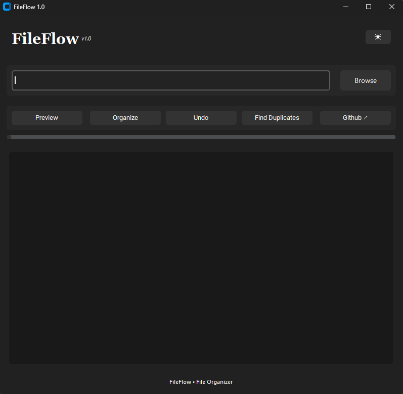
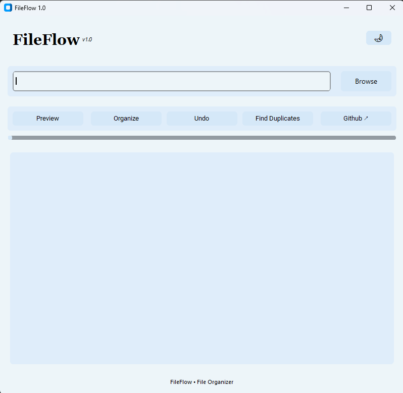
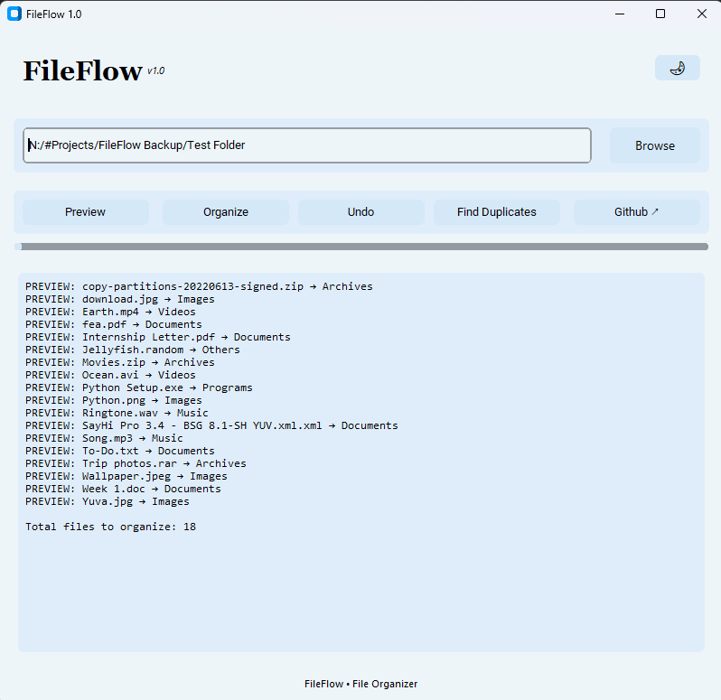
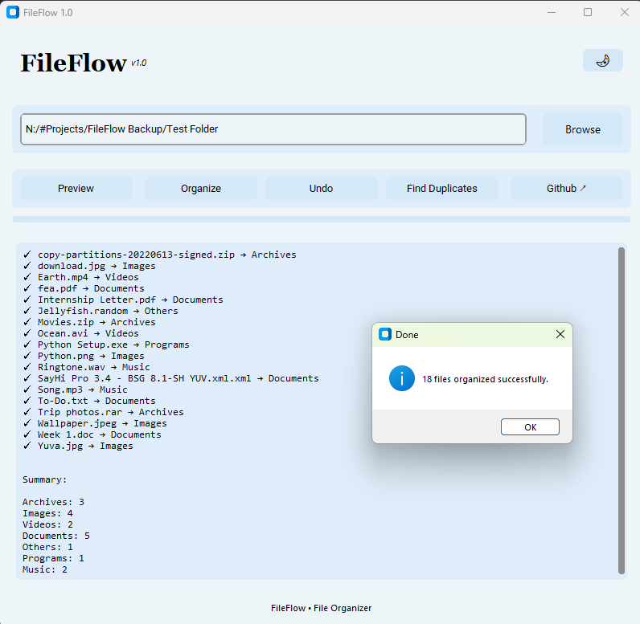
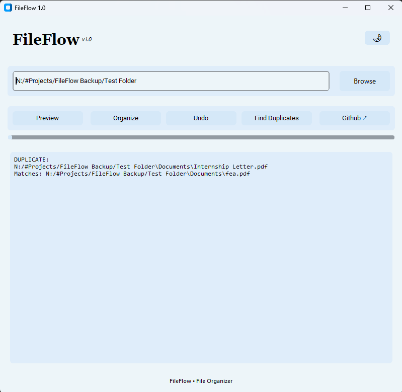

# FileFlow 2026

FileFlow is a Python-based file organization tool that automatically sorts files into folders based on file type, helping users keep their downloads and documents organized.

## Features

- Organize files by extension and category.
- Duplicate file detection.
- Preview file movements.
- Undo file movements.
- Light/Dark themes.
- Progress tracking.
- GitHub integration.

## Screenshots

## Technologies Used

- Python
- CustomTkinter
- OS Module
- Hashlib
- Shutil

## Download

Download the latest FileFlow.exe from [releases](https://github.com/K-SuhasM/FileFlow/releases)

## Author

Koustubh Suhas Mandle, Btech CSE final year.
